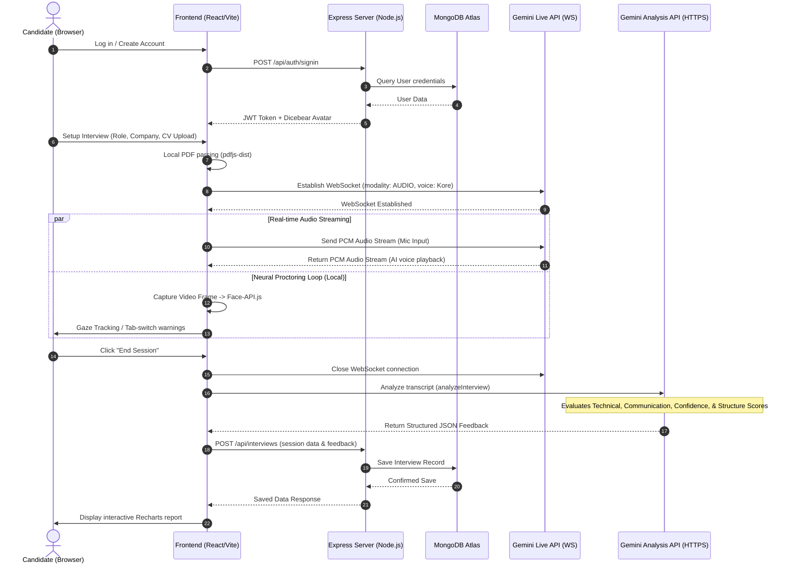

# SkillSpeak: AI Interview Coach 🎙️🤖

[](https://react.dev/)
[](https://www.typescriptlang.org/)
[](https://vite.dev/)
[](https://deepmind.google/technologies/gemini/)
[](https://www.mongodb.com/)
[](https://expressjs.com/)

**SkillSpeak** is an immersive, real-time AI-powered interview coaching application that mimics real hiring processes. Leveraging Google Gemini's advanced Live Audio API and computer-vision-based neural proctoring, SkillSpeak provides high-fidelity, spoken mock interviews. It analyzes not just *what* you say (technical correctness and answer structure) but *how* you say it (communication skills and confidence metrics) while simultaneously evaluating your focus and behavior.

---

## 💡 Core Concept & Demo Details

SkillSpeak bridges the gap between static text-based mock interviews and actual high-pressure job interviews. Rather than relying on simple speech-to-text text pipelines, SkillSpeak implements a **bidirectional, low-latency live WebSocket connection** using native audio formats, enabling a direct verbal conversation with an AI Recruiter.

### System Overview
- **Vocal Engagement**: Speak directly to the AI interviewer. The interviewer replies with custom, human-like voice patterns (using the Gemini `Kore` voice) matching the company profile and experience level.
- **Smart Customization**: The interviewer reads your uploaded resume (PDF) and cross-references it with your target job description, title, and company to ask highly targeted technical and behavioral questions.
- **Neural Proctoring**: Real-time canvas overlays map facial landmarks to track camera gaze deviation, check for user absence, detect multiple people, and catch tab switches.
- **Dashboard Metrics**: Receive a detailed evaluation post-interview complete with visual Recharts breakdown, transcript audits, and proctor logs.

---

## 🚀 Key Features

### 🎙️ 1. Bidirectional Gemini Live Audio Simulation
- Establishes a raw audio WebSocket pipeline streaming **16kHz PCM input** and playing **24kHz PCM output** directly from Gemini’s preview model.
- Mimics a phone or video screen with verbal queues, interruptibility, and organic speech patterns.
- Displays responsive **"AI Speaking"** vs **"AI Listening"** status glows based on audio packet streaming.

### 👁️ 2. Neural Behavior Proctoring (Local CV)
- Integrated `@vladmandic/face-api` runs a Tiny Face Detector model inside the candidate's browser.
- **Attention Tracking**: Warns the user if they look away from the camera (`gaze direction` ratio evaluation on nose/eyes horizontal alignment).
- **Security Scans**: Detects multiple faces in the frame or warns immediately when the face is missing.
- **Focus Verification**: Hooks into window blur listeners to alert the user if they switch tabs or open other screens.

### 📄 3. CV Parsing & Dynamic Prompting
- Frontend PDF reader via `pdfjs-dist` converts uploaded resume PDFs into text on the fly.
- Feeds resume text alongside target company name, job role, and difficulty level into the prompt constructor to dynamically customize questions.

### 📊 4. Deep Analytical Feedback Report
- Invokes `gemini-3-flash-preview` in structured JSON Schema mode to compute multiple performance scores:
  - **Overall Score**: Weighted average of the entire simulation.
  - **Technical Correctness**: Precision of answers to specialized interview problems.
  - **Communication & Structure**: Evaluation of answer flow, clarity, and articulation.
  - **Confidence**: Assessment of speech patterns and vocabulary.
  - **Relevance**: Alignment of candidate responses with the prompt context.
- Renders an interactive performance dashboard via **Recharts** displaying score radar charts and historical metrics.

### 🔒 5. Full Security & Auth Suite
- Secure user signup, signin, and profile updating backed by **JWT validation** and **BcryptJS** password hashing.
- **Email OTP Verification**: Delivers beautifully designed verification emails using SMTP (Nodemailer).
- **Dicebear Avatar Engine**: Generates unique, responsive SVG user profile pictures dynamically from random seeds.

---

## 📐 System Architecture

The following diagram illustrates how the frontend components, Express server, MongoDB database, and Google Gemini API interact:



---

## 🛠️ Technology Stack

| Component | Technology / Library | Description |
| :--- | :--- | :--- |
| **Frontend Core** | React 19, TypeScript, Vite 6 | Fast modern compiler and UI framework |
| **Styling** | Tailwind CSS, Custom Glassmorphic CSS | Premium modern aesthetic, animations, and dark/light modes |
| **AI Integration** | `@google/genai` (V1 Developer SDK) | Gemini Live WS API & structured response text API |
| **Computer Vision**| `@vladmandic/face-api` (Local Wasm/JS) | Face Landmark analysis & proctoring alerts |
| **Visualization**  | `recharts` | Render performance score breakdowns |
| **PDF Parser**     | `pdfjs-dist` | Ingest CV text directly inside the browser |
| **Backend Core**  | Node.js, Express 5.x | API Server & routing engine |
| **Database**       | MongoDB, Mongoose 9.x | Session storage & User records |
| **Security**       | `bcryptjs`, `jsonwebtoken` (JWT) | Password hashing & authorization middleware |
| **Email Services** | `nodemailer` | Dispenses OTP emails for verification and password reset |

---

## 📁 Repository Structure

```
skillspeak/
├── api/
│   └── index.js             # Vercel entrypoint router (serverless hosting)
├── assets/                  # Public visual and audio resources
├── components/              # React components
│   ├── AuthModal.tsx        # Toggle quick access logins
│   ├── AuthPage.tsx         # Register/Sign-in & verification interface
│   ├── FeedbackReport.tsx   # Scoring, comments, and Recharts charts
│   ├── ForgotPassword.tsx   # OTP verification & credentials reset
│   ├── HomePage.tsx         # Dashboard landing page
│   ├── InterviewSetup.tsx   # CV upload, job role selection, settings toggles
│   ├── Layout.tsx           # Global wrap, theme switcher, and navigation header
│   ├── LiveInterview.tsx    # Live simulation, local video processing, audio capture
│   └── ProfilePage.tsx      # User settings & historical transcripts
├── services/                # API communication layers
│   ├── audioService.ts      # Base64 coder/decoder, Float32 to Int16 PCM normalizer
│   ├── authService.ts       # Backend HTTP routes handler
│   └── geminiService.ts     # Gemini analysis schema setup
├── server/                  # Backend Express Node application
│   ├── index.js             # Express connection & port listener
│   ├── loadEnv.js           # Env variables directory loading
│   ├── models/              # Mongoose DB schemas (User, Interview)
│   ├── routes/              # Express route controllers (auth, interviews)
│   └── utils/               # Node helper scripts (mailer)
├── constants.ts             # Prompts & system instructions configuration
├── types.ts                 # TypeScript type interfaces
├── vite.config.ts           # Environment mapping & proxy configuration
└── index.html               # Main template & face detector imports
```

---

## ⚙️ Getting Started & Installation

Follow these steps to spin up the local development environment.

### 📋 Prerequisites
- **Node.js** (v18.0.0 or higher)
- **MongoDB Atlas** account (or local MongoDB database instance)
- **Google AI Studio** Gemini API Key (obtain from [Google AI Studio](https://aistudio.google.com/))
- **Gmail Account & App Password** (if configuring registration emails; check [Google App Passwords](https://myaccount.google.com/apppasswords))

### 🔧 Step-by-Step Setup

1. **Clone the Repository:**
   ```bash
   git clone https://github.com/AmalAntoney123/skillspeak-interview-ai.git
   cd skillspeak-interview-ai
   ```

2. **Configure Environment Variables:**
   Create a `.env.local` file in the root directory and fill out the following keys:
   ```env
   # Google Gemini API Key
   GEMINI_API_KEY=your_gemini_api_key_here

   # Database connection string
   MONGO_URI=mongodb+srv://<user>:<password>@cluster.mongodb.net/skillspeak_db

   # JWT signing key
   JWT_SECRET=your_jwt_secret_key_here

   # SMTP configuration (Gmail example)
   GMAIL_USER=your_email@gmail.com
   GMAIL_PASS=your_gmail_app_password
   ```

3. **Install Dependencies:**
   ```bash
   npm install
   ```

4. **Launch the Express Backend Server:**
   ```bash
   # Starts the server on port 5000
   node server/index.js
   ```

5. **Launch the Vite Frontend Client:**
   ```bash
   # Starts the client server on port 3000
   npm run dev
   ```
   *The client dev server automatically handles `/api/*` proxies to route calls to the backend running on port 5000.*

6. **View the Application:**
   Open [http://localhost:3000](http://localhost:3000) in your web browser.

---

## 🛡️ Vercel Deployment

This project includes a `vercel.json` rewrite configuration. When hosting on Vercel:
- The React frontend compiles via `vite build` into a static bundle.
- The `/api/(.*)` paths automatically map to the serverless server entry point in `api/index.js`.
- Make sure to configure all environment variables (from `.env.local`) in the Vercel Project Dashboard.

---

## 🤝 Contributing

Contributions make the open-source community an amazing place to learn, inspire, and create.
1. Fork the Project.
2. Create your Feature Branch (`git checkout -b feature/AmazingFeature`).
3. Commit your Changes (`git commit -m 'Add some AmazingFeature'`).
4. Push to the Branch (`git push origin feature/AmazingFeature`).
5. Open a Pull Request.

---

## 👤 Author

**Amal Antoney**
- GitHub: [@AmalAntoney123](https://github.com/AmalAntoney123)
- Role: MCA Student, Software Engineer & ML Enthusiast.
- Connections: [LinkedIn](https://linkedin.com) • [Instagram](https://instagram.com) • [Portfolio](https://github.com/AmalAntoney123)
